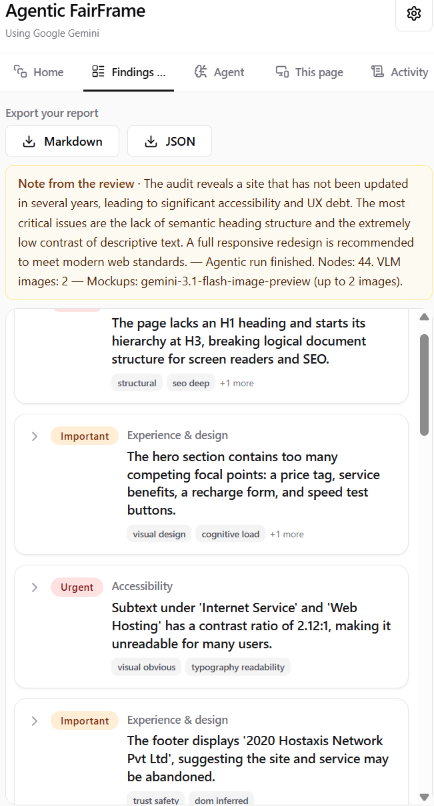
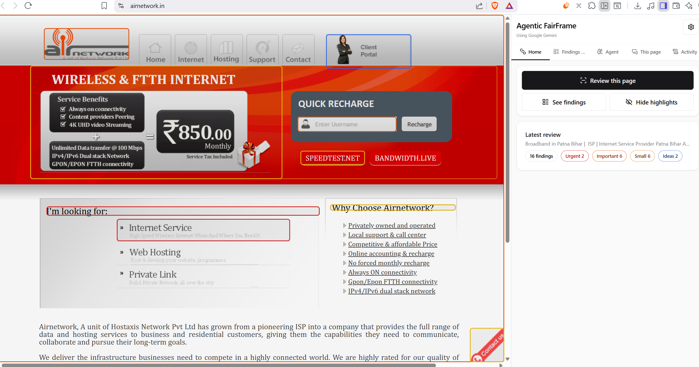
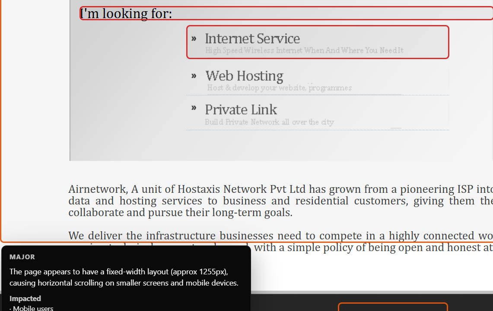
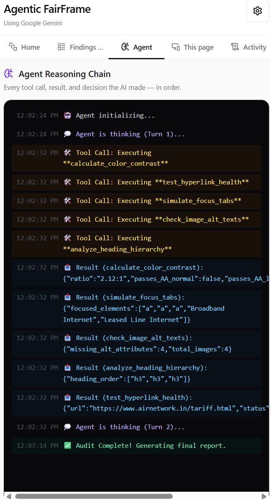

# 🤖 Agentic FairFrame

> **Your AI-powered QA and Design Critic** — Now supercharged with autonomous "Agentic" capabilities. It doesn't just look at your webpage; it actively tests it.

Agentic FairFrame lives right in your Chrome **side panel**. Open any website, run a review, and watch the AI agent think, test, and analyze the page in real-time to give you actionable, plain-language findings.

---

## ✨ What's New: The "Agentic" Upgrade
*We've upgraded FairFrame from a static analyzer to an autonomous AI agent. Here is what that means in plain English:*

Instead of simply sending your website data to an AI and waiting for one final answer, the AI now runs in a **continuous loop** (Query → LLM Response → Tool Call → Tool Result → Query...). Each time the AI wants to test something, it calls a tool, looks at the result, and *then* decides its next move.

- 🧠 **Live Thought Process:** No more waiting in the dark! Watch the AI's "brain" work in real-time. The side panel displays a live terminal of the agent's reasoning chain as it figures out what to test.
- 🛠️ **Active Page Testing (Real Tools):** Instead of just guessing from a screenshot, the AI now uses specialized tools to directly interact with your page:
  - 🎨 **Calculates exact color contrasts** to ensure text is mathematically readable (WCAG AA standards).
  - 🔗 **Pings hyperlinks** to catch embarrassing broken (404) links before your users do.
  - ⌨️ **Simulates keyboard navigation** by "tabbing" through the page to ensure accessibility for all users.
  - 🖼️ **Analyzes Image Alt Texts** to check how many images are missing descriptive `alt` tags critical for screen readers.
  - 📑 **Checks Heading Hierarchy** by extracting the exact sequence of H1, H2, etc., tags to ensure a logical structure for SEO and accessibility.
- 👁️ **Smarter, Evidence-Based Feedback:** The AI combines visual layout analysis with actual interactive tests to give you highly accurate UX, UI, and accessibility recommendations.

---

## 📸 See it in action



| Side Panel View | Highlights View |
| :---: | :---: |
|  |  |
|  |  |

> **[🎥 Watch the Original Demo on YouTube](https://www.youtube.com/watch?v=DjgX9082ku4)** *(Walkthrough of the classic features prior to the Agentic upgrade).*

---

## 🚀 Core Features

| | |
| :--- | :--- |
| 🤖 **Agentic Loop** | Watch the AI's reasoning chain and tool executions happen live in the Side Panel terminal. |
| 📝 **Smart Review** | Analyzes what’s on screen and how the code is built, then suggests practical improvements — not just a dry checklist. |
| 🎯 **Visual Highlights** | Draws optional highlight boxes directly on the webpage so you know exactly *where* the issue is. |
| 🕰️ **Audit History** | Remembers recent runs on the same URL so you can easily compare changes over time. |
| 📥 **Easy Export** | Download a **Markdown** or **JSON** report to easily share with your developers, designers, or QA team. |

**Default AI Engine:** [Google Gemini](https://ai.google.dev/) (just add your own free API key).  
**Alternative:** You can point Agentic FairFrame at **your own server** if you prefer a custom backend.

---

## ⚡ Quick Start

1. **Get the code** and install the dependencies:
   ```bash
   npm install && npm run build
   ```
2. **Load into Chrome:** Open `chrome://extensions`, toggle **Developer mode** on, click **Load unpacked**, and select the `dist` folder from this project.
3. **Add your API Key:** Open **Agentic FairFrame** from the Chrome extensions menu or side panel. Add your **Gemini API key** ([get one free here](https://aistudio.google.com/apikey)) when prompted.
4. **Start Testing:** Visit any website, open the side panel, and click **Review this page**. Sit back and watch the agent test your page!

*Pro-tip: Set up a keyboard shortcut (e.g., `Ctrl+Shift+U`) under `chrome://extensions/shortcuts` to run reviews instantly.*

---

## ⚙️ Settings & Configuration

- **API Key** — Required when using the default Gemini setup. (Developers can also put `GEMINI_API_KEY=...` in a project `.env` file).
- **Models** — By default, it uses the best available Gemini models. You can easily override these in the options page to try newer models as they are released.
- **AI Mockups** — *Optional feature:* The AI can generate **picture ideas** or wireframes for some of its design findings. You can toggle this on or off.
- **Custom Server** — Want to build your own AI backend? Enter your custom API URL in the settings to bypass Gemini entirely.

---

## 🔒 Privacy

Agentic FairFrame only reads **the active tab you choose to review**. Your data stays locally on your machine, except when safely transmitted to **Google Gemini** (or your custom server) for the analysis. See [Google AI terms](https://ai.google.dev/terms) for details.

---

## 💻 For Developers

| Command | Purpose |
| :--- | :--- |
| `npm run typecheck` | Run TypeScript validation |
| `npm run verify` | Build project and run a quick sanity check |
| `npm run icons` | Regenerate all PNG icons from the `public/icons/icon-source.svg` file |

**Architecture highlights:**
- `src/background/geminiAudit.ts`: The core "Agentic Loop" where the AI reasons and decides which tools to call.
- `src/background/agentTools.ts`: The actual JavaScript functions (tools) the AI triggers (e.g., contrast checker, link health, tab simulator, image alt checker, heading hierarchy analyzer).
- `src/sidepanel/App.tsx`: The React UI that displays the real-time reasoning terminal.

---

<p align="center"><strong>Agentic FairFrame</strong> · Open Source Chrome Extension</p>